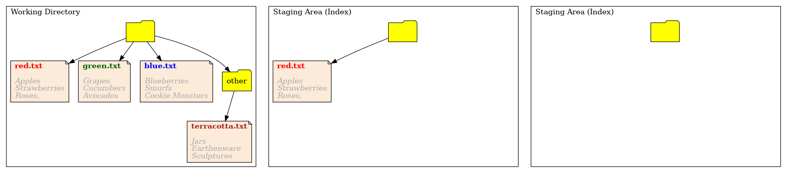
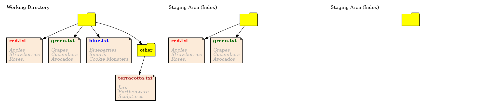
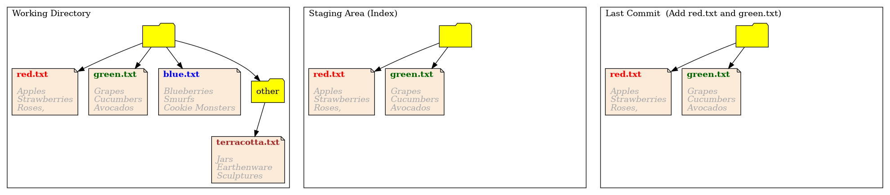
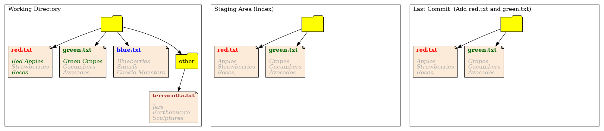
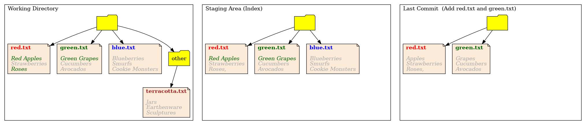



In this episode, we'll discuss the basics of adding and commiting files. We will however take great care with the mental picture we create git commits. This mental picture might be different from the way in which you've thought about git in the past, but understanding it is first step to truly understanding git.

# Setup
Assuming that you've downloaded the lesson material to the directory `~/git-demystified`, we can
change into the directory for this episode with:
~~~
$ cd ~/git-demystified/episode_1
~~~
{: .language-bash}

In this episode, we'll discuss the basics of adding and commiting files. We will however take great care with the mental picture we create git commits. 
We can see the files in this folder or directory with:
~~~
$ ls
~~~
{: .language-bash}

We can look inside one of the files with:
~~~
$ cat blue.txt
~~~
{: .language-bash}

Which will give us the output:
~~~
Blueberries
Smurfs
Cookie Monsters
~~~
{: .output}

The `other` entry in `ls` a folder, we can look inside with:
~~~
$ ls other
~~~
{: .language-bash}

So far, this is just a plain directory with files. Let's initialise it with
~~~
$ git init .
~~~
{: .language-bash}

# Changes as Differences

Let's start by reviewing what we might think about add and commit so far.

We'll start by add the file red.txt
~~~
$ git add red.txt
~~~
{: .output}

Finally, we'll have a look at the status of files with:
~~~
$ git status
~~~
{: .language-bash}

We'll see the output
~~~
On branch master

No commits yet

Changes to be committed:
  (use "git rm --cached <file>..." to unstage)
	new file:   red.txt

Untracked files:
  (use "git add <file>..." to include in what will be committed)
	blue.txt
	green.txt
	other/
~~~
{: .output}

When you're starting out, it's helpful to think of `git add` as adding the changes that you've made to a file to the staging area. But we're going to be looking at a more accurate and useful way of thinking about this later in this episode. For these simple actions, both these approaches are equivalent.

For more advanced usage however, this mental model breaks down quickly. We need to unlearn this way of thinking and learn to think of git in terms of snapshots. This will be the topic of the rest of this chapter.

# The Three Trees

Git is often described as manipulating _trees_ of files, you can think of them as three folders.

These are:

1. The `working directory` - your current git files
2. The `staging area` - where you prepare the next commit
3. The current commit or `HEAD` - the current commit, the one you're building on top of.

The following images shows how these three trees looks currently after adding `red.txt` to the staging area.

Git add has copied the file `red.txt` into the staging area. It hasn't done anything more complicated than that. This is how git stores the changes we've made.

Lets look at the output of git status again:
~~~
$ git status
On branch master

No commits yet

Changes to be committed:
  (use "git rm --cached <file>..." to unstage)
	new file:   red.txt

Untracked files:
  (use "git add <file>..." to include in what will be committed)
	blue.txt
	green.txt
	other/
~~~
{: .output}

It seems like git status is in fact a summary of the differences between `HEAD` and the staging area. Git computes this on the fly when you call git status, which is why git status can sometimes take a long time in a very large commit.

Next we add the file `green.txt`:
~~~
$ git add green.txt
~~~
{: .language-bash}

Now the staging area changes, but the working directory and the last commit stay the same. Remember that git add it a copy. The staging area now looks like:

Once again, if we typed git status it would summarise the differences between the staging area and the commit.
~~~
$ git status
On branch master

No commits yet

Changes to be committed:
  (use "git rm --cached <file>..." to unstage)
	new file:   green.txt
	new file:   red.txt

Untracked files:
  (use "git add <file>..." to include in what will be committed)
	blue.txt
	other/
~~~
{: .output}

Now lets create our first commit
~~~
$ git commit -m "Add lists of red and green objects"
~~~
{: .language-bash}

The only thing that changes here is the current `HEAD`. Git took the staging area, the next proposed commit, and made _it_ the current comit. It did this by first storing the previous commit away somewhere. Then replacing this with a copy of the current staging area, making that the current `HEAD` commit.

> ## Keeping history
> Note that we clearly don't overwrite the previous commit. Imagine putting the previous commit in storage somewhere, and replacing it with the contents of the staging area. We'll discuss how this storage works later.
{: .callout}

Let's take another look at git status
~~~
$ git status
~~~
{: .language-bash}
~~~
On branch master
Untracked files:
  (use "git add <file>..." to include in what will be committed)
	blue.txt
	other/
~~~
{: .output}

Git reports on the untracked files, which are the files which have never been added to the `staging area`. There are no other differences to report.

Note how the commit contains a *complete snapshot of all files*, as if you had copied them there by hand.

Also, note how the staging area contains the previous files, not just the changes we've made in this commit.

## Crafting commits

Let's make some changes in the working directory, by editing the files. First we'll edit `red.txt`, changing `Apples` to `Red Apples` and changing `Roses,` to `Roses` (removing the comma). We'll do this with:
~~~
$ nano red.txt
~~~
{: .language-bash}

Then we'll edit `green.txt` changing `Grapes` to `Green Grapes`:
~~~
$ nano green.txt
~~~
{: .language-bash}

The working directory now looks like, we've highlighted out changes in green:

We've made all these changes at once, but let's turn this into distinct commits:
1. One commit that adds the lines which correct typographical erros
2. One commit that adds the file `blue.txt`, and updates colours

Normally, we would avoid adding two distinct changes to the same commit. But we'll come back and fix this later.

To add the typographical error, we need to add only part of a file. We can do this with
~~~
$ git add -p red.txt
~~~
{: .language-bash}

We select `s` to split the hunk that git presents us with, `y` to accept the first change, and `n` to reject the second.

Next we add `blue.txt` and the changes from `green.txt`
~~~
$ git add blue.txt green.txt
~~~
{: .language-bash}

Finally, we check that status:
~~~
$ git status
~~~
{: .language-bash}

~~~
On branch master
Changes to be committed:
  (use "git restore --staged <file>..." to unstage)
	new file:   blue.txt
	modified:   green.txt
	modified:   red.txt

Changes not staged for commit:
  (use "git add <file>..." to update what will be committed)
  (use "git restore <file>..." to discard changes in working directory)
	modified:   red.txt

Untracked files:
  (use "git add <file>..." to include in what will be committed)
	other/
~~~
{: .output}

Note how `red.txt` appears in both sections.

We can see explicitly what is still not staged with:
~~~
$ git diff
~~~
{: .language-bash}

By default, this shows the differences between the working directory and the staging area.
We can see an explicit diff between `HEAD` and `staging area` with
~~~
diff --git a/red.txt b/red.txt
index 90498cb..c6b61f8 100644
--- a/red.txt
+++ b/red.txt
@@ -1,3 +1,3 @@
 Red Apples
 Strawberries
-Roses,
+Roses
~~~
{: .output}

In this case, it would be more useful to see what it about to make it into the next commit. We do this with
~~~
$ git diff --cached
~~~
{: .language-bash}

~~~
diff --git a/blue.txt b/blue.txt
new file mode 100644
index 0000000..d783f04
--- /dev/null
+++ b/blue.txt
@@ -0,0 +1,3 @@
+Blueberries
+Smurfs
+Cookie Monsters
diff --git a/green.txt b/green.txt
index 33f7e97..158c5d5 100644
--- a/green.txt
+++ b/green.txt
@@ -1,3 +1,3 @@
-Grapes
+Green Grapes
 Cucumbers
 Avocados
diff --git a/red.txt b/red.txt
index 8224889..90498cb 100644
--- a/red.txt
+++ b/red.txt
@@ -1,3 +1,3 @@
-Apples
+Red Apples
 Strawberries
 Roses,
~~~
{: .output}

The `git diff --cached` command shows, if we did commit now, how would the resulting commit be different to the current commit.

Let's take a look at how our three trees look at this stage:

Note how `git -p` has created a file in the staging area, from the instructions we've given it, in a state in which the file has never existed in the working directory.

We'll now commit this
~~~
$ git commit -m "Added colour specification and blue.txt"
~~~
{: .language-bash}

Let's take a look at our log
~~~
$ git log --oneline
~~~
{: .language-bash}

Note how git gives us an identifier for each commit, and that the identifiers on your machine are different to mine.

# Everything else

Finally, we'll commit everything that is left with
~~~
$ git add red.txt other/
$ git commit -m "Changes"
~~~
{: .output}

This will copy all the files from out working directory into the staging area, then create a new commit which will also be identical to the working area. After doing this, all three areas will be the same.

We can verify this with
~~~
$ git status
~~~
{: .language-bash}

>## Patching
>Make as many changes as you like to any files you like, making sure to make multiple changes to the same file. Use `git add -p` to create multiple commits that each contain only some of the changes. You can practice:
>* choosing sections to add/remove to a commit with <kbd>y</kbd> and <kbd>n</kbd>
>* splitting up changes grouped together using <kbd>s</kbd>
>* splitting up changes on the same line into different commits using <kbd>e</kbd>
{: .challenge}
