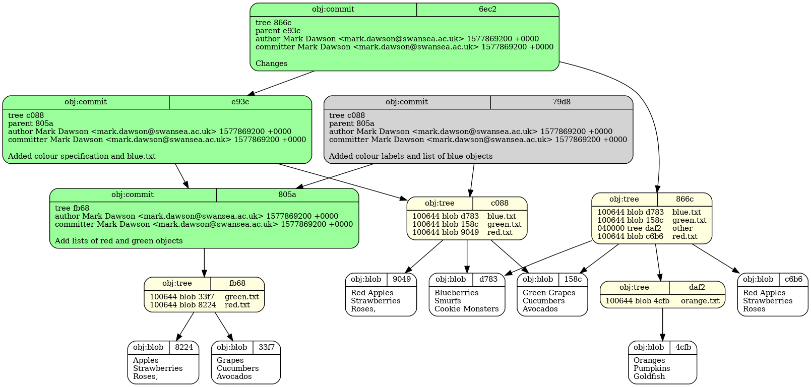



## Git Objects
Git stores everything it knows about your changes and history in a database called the object database.

First, we'll navigate to the material for this episode:
~~~
$ cd ~/git-demystified/episode_3
~~~
{: .language-bash}

And take a look at the content:
~~~
$ git log --all --oneline --graph
~~~
{: .language-bash}

This is the same merge from the end of the last episode.
~~~
*   8339406 (HEAD -> phantom-tracker) Merge branch 'another-phantom-tracker' into phantom-tracker
|\  
| * b7945fb (another-phantom-tracker) Added phantoms
* | cbfc473 Added phantoms
|/  
* cd3a38a Phantom commit
| * 6ec2577 (master) Changes
|/  
* e93c765 Added colour specification and blue.txt
* 805a6c8 Add lists of red and green objects
~~~
{: .output}

Let's take a look at the objects that git knows about:
~~~
$ find .git/objects -type f
~~~
{: .language-bash}

This is a UNIX command to find every file in the `.git/objects` directory. There are quite a few.

Let's look in particular at `.git/objects/6e/c2577e32f1e4484f098a97656ca7bd62800596`

Don't try to look into this file with `cat`, it's a compressed binary file which won't be readable. Git gives us a special command to decompress the content.
~~~
$ git cat-file -p 6ec2577
~~~
{: .language-bash}

~~~
tree 866cc5a7af96b7636c74588b110624379860d42e
parent e93c765e847e46a9200d43ff7ef7115b3c7c486b
author Mark Dawson <mark.dawson@swansea.ac.uk> 1577869200 +0000
committer Mark Dawson <mark.dawson@swansea.ac.uk> 1577869200 +0000

Changes
~~~
{: .output}

This is the commit "Phantom commit". It seems to have a reference to a tree object (`866cc5a`) and a parent (`e93c765`). It also has the author, timestamp and commit message.

We can follow these idenifiers again with `git cat-file -p`:
~~~
$ git cat-file -p e93c765
~~~
{: .language-bash}

Shows the previous commit
~~~
tree c08804ed275c9118e61a36966039acc2c750ad33
parent 805a6c841c5a2e464fbcc671fa651bca811c2abc
author Mark Dawson <mark.dawson@swansea.ac.uk> 1577869200 +0000
committer Mark Dawson <mark.dawson@swansea.ac.uk> 1577869200 +0000

Added colour specification and blue.txt
~~~
{: .output}

Both commits have a `tree` object. This is the root of the tree in the HEAD version of the three trees as it was when this commit was created. Let's take a look at the one for "Phantom commit".
~~~
$ git cat-file -p 866cc5a
~~~
{: .language-bash}

~~~
100644 blob d783f04d417b22a5fdbf369c418203d5f9173e37	blue.txt
100644 blob 158c5d5d8b0bf4fdbe817c9320275ec38f75fe35	green.txt
040000 tree daf27696e906b6663e4cb8601a96b04aca27eee0	other
100644 blob c6b61f8fd1e47b30a21de6db1841bd71f7e340d2	red.txt
~~~
{: .output}

This looks like a listing of file and folder names. The folders are tree objects, and the files are blob objects.

Let's look at one of the blob objects, `blue.txt` for example
~~~
$ git cat-file -p d783f04
~~~
{: .language-bash}

~~~
Blueberries
Smurfs
Cookie Monsters
~~~
{: .output}

For a simple version of this lesson, such as the state of the repository at the end of the first episode,
we can look at all the objects.

# Content-addressable Storage

_Git is fundamentally a content-addressable file system with a version control system user interface written on top of it._ - The Pro Git Book

So what is a content-addressable file system?

This is a system in which the names of files are directly determined by their content. We take a fingerprint of file content before we write it, and use that as the file name. In this system, every single object with the same content, goes in the same file, and is by definition the same thing.

Any file which contains
~~~
Green Grapes
Cucumbers
Avocados
~~~
{: .output}
in any git repository in existance will always be stored in the file `.git/objects/15/8c5d5d8b0bf4fdbe817c9320275ec38f75fe35`.

In git, this is true of blobs (file content), tree (file names and directory structure) and commits (metadata about commiting)

Since commits are made from blobs and trees, which in turn are made from blobs - this effect bubbles up. If two commits have the same ID, this is an very strong guarantee that they're identical, include all the content in all the files and all the history of commits, and the content in all those commits. In practice, this turns out to be very powerful.

The converse is true however. If you change even the slightest thing about a commit, or the contents of a commit, be definition this will be a new commit.

>## Mutable blobs
> Look at blob `4cfb` in the diagram above. Imagine that this is replaced in a commit by different content. What else objects would need to change for the commit "Changes" to have identical content, but with this one object changed?
>> ## Solution
>> 1. The contents of tree `daf2` would change since it contains the ID of the blob.
>> 2. Since the contents changes, the ID of the tree also changes (which by definition would now be a different tree)
>> 3. This causes the content, and therefore ID of `866c` to change - creating a new tree
>> 4. The tree identifer in the top level commit would change, which in turn would change the commit identifier.
>> 5. There would be a new commit identifier, with some blobs shared with the previous example.
>{: .solution}
>
{: .challenge}

We can see this database for ourselves by looking inside the `.git/objects` directory.
~~~
$ cd ~/.git
$ find .git/objects -type f
~~~
{: .language-bash}

Git seems to do a lot for us, and it can seem to work in mysterious ways. The aim of this short section is to give some insight into the magic that git does for us.

What is a commit, and how does it all work? Git is based on the idea of creating unique (or almost unique) 40 character "fingerprints" for everything (or almost everything) that it knows about. You've probably seen these everywhere. Git has three types of object referenced by these IDs: commits, trees and blobs. We'll explore these one at a time, you'll often see these mentioned in the documentation, and this can be intimidating.

### Content-addressable storage

Content addressable storage is a way to store information that is indexed by its content. If we know its content, we know its location. If the content changes, the location changes. If the content is the same, the location is by default the same. The "Pro Git" book, mentions:
"Git is fundamentally a content-addressable file system with a version control system user interface written on top of it."

We can see the list of content that git knows about, known as `objects` in git speak in the `.git/objects` directory, let's try this:
~~~
$ ls .git/objects
~~~
{: .language-bash}
We can't look directly inside these objects, because they're compressed with the zlib library, but they are just text files. Git provides a `cat-file` command to decompress these objects. 

Many of the git commands you may be familiar with can be thought of as scripts that manipulate these objects.

### Commit Objects
There are three types of object that git manipulates as content-addressable.

The first we'll look at we're already familar with, the commit, but what are commits really? Commits are a type of git `object`, stored in this content-addressable system. It's a file is a file in the `.git/objects` directory. We can't read it directly because there is some compression applied, but git allows us to extract the contents of git file with the `cat-file` command.
~~~
$ git cat-file -p 15aab
~~~
{: .language-bash}
Finally we can see understand what a commit actually contains.
~~~
tree d570b2c26081ff4794e72fa3dd2cc38062df9910
parent 5bca8d9358f5b08af40ac32f289bb14b18965cec
author Jerome Baum <jerome@jeromebaum.com> 1348580812 +0200
committer Jerome Baum <jerome@jeromebaum.com> 1348580812 +0200

Use git_do where appropriate
~~~
{: .output}
This is *everything* that git knows about a commit. It also contains some other metadata, and a tree, which looks like another tree. If any of this information changes (including this tree ID), the commit ID (or fingerprint) will also change. All of this should to be exactly identical for an identical commit ID. If we change any of these things, we will by definition have a commit with a different ID. Note that the commit ID isn't included here, can you work out why?

Importantly, a commit only knows about its parents, not its children. This makes sense. We don't know the children of a commit when we create it, and if we add this information later, it would changing the commit ID or fingerprint.

If the content of a file or its name changes, then the tree object will change. This results in a different commit fingerprint, since the tree is part of the data in the commit.

### Tree Objects
What is this tree object? Since we know its ID, we can look up the contents with `cat-file`, just as we did for the commit. The tree is just another thing that git knows about, collectively known as `objects`.

~~~
$ git cat-file -p d570
~~~
{: .language-bash}
We see the information in a tree object
~~~
100644 blob 8d038485fc10058d4e078954e17eb262f8263cfe    .gitignore
100644 blob 85665678e4acc7a6961bc989073a217e8f0e815b    .gitmodules
100644 blob aded955fca44f9199b340667048f7a4f7504e4e6    AUTHORS
100644 blob 2281f2307d8123fc13f157953b3c69dd935aaaee    Changes.mdown
100644 blob cedd1823140299f7862bf84afa0f217e2b1ac9e7    LICENSE
100644 blob fbbfd2c00016b174c351addde78985f7064ddb3d    Makefile
100644 blob a01079b4baae9ea3af2c9e05ead57f2667f0460c    README.mdown
100755 blob f7494c9b82d892323d951156d863c39f8b7cd47d    bump-version
040000 tree b5369782e23c81adbcabbf388504690d9217d7ba    contrib
100755 blob fd16d5168d671b8f9a8a8a6a140d3f7b5dacdccd    git-flow
100644 blob 55198ad82cbfe7249951aa75f1373a476997d33a    git-flow-feature
100644 blob ba485f6fe4b7d9c35bc01d2a6bd4ae201bccc9bd    git-flow-hotfix
100644 blob 5b4e7e807423279d5983c28b16307e40dfdb51d7    git-flow-init
100644 blob cb95bd486deb7089939362705d78b2197893f578    git-flow-release
100644 blob cdbfc717c0f1eb9e653a4d10d7c4df261ed40eab    git-flow-support
100644 blob 8c314996c0ac31f1396c48af5c6511124002dab7    git-flow-version
100644 blob 33274053347f4eec2f27dd8bceca967b89ae02d5    gitflow-common
120000 blob 7b736c183c7f6400b20ea613183d74a55ead78b5    gitflow-shFlags
160000 commit 2fb06af13de884e9680f14a00c82e52a67c867f1  shFlags
~~~
{: .output}
Note how each entry has an ID that's very similar to the ones we've seen before. A tree is a list of file names and an ID, that tells us where we can find the content. The tree object can contain other trees (for example the *contrib* directory), this is how git handles directory trees. Others are files, such as the AUTHORS file. Note that the tree knows only the ID, but knows nothing about the content.

### Blob Objects
Blobs are just the word git uses for the content of a file without its name. If two files contained the exact same content, they would both point to the same blob with a different filename. Let's take a look at a blob, the `AUTHORS` file above for example:

~~~
$ git cat-file -p aded
~~~
{: .language-bash}
This is *everything* that git knows about this blob, it doesn't know the file name only the content.
~~~
Authors are (ordered by first commit date):

- Vincent Driessen
- Benedikt Böhm
- Daniel Truemper
- Jason L. Shiffer
- Randy Merrill
- Rick Osborne
- Mark Derricutt
- Nowell Strite
- Felipe Talavera
- Guillaume-Jean Herbiet
- Joseph A. Levin
- Jannis Leidel
- Konstantin Tjuterev
- Kiall Mac Innes
- Jon Bernard
- Olivier Mengué
- Emre Berge Ergenekon
- Eric Holmes
- Vedang Manerikar
- Myke Hines

Portions derived from other open source works are clearly marked.
~~~
{: .output}
This is the content of the file AUTHORS, but just the content. Notice, there is not reference to a filename. It's just a nameless blob of information. The ID of the blob is the name git uses for it, and that is derived from this content. Like a fingerprint. We'll see how this is a very powerful idea. Note that this means that two files with the same content, by definition reference the same blob. Note also that a blob is a specific version of the file content. A different versiono f the same file will have a different blob.

>## Turtles all the way down
Note that if the content of a blob changes (e.g. by changing the content) then the ID changes, and consequentially the tree and commit IDs will change. Note, since a commit references the parent, *all child commits* will also change. Likewise if a tree changes (by renaming or moving files or directories), then the commit and all of its parent commits will change. It has been noted that git is a content-addressable filesystem, with a version control system build on top of it.
{: .callout}

>## Well...not quite
Not all things git knows about are objects. Branches, the HEAD pointer, the staging area (or index) and tags are information that git holds which are not objects.
{: .callout}

>## Commit-ish and Tree-ish
> In documentation you might see many references to things that are commit-ish or tree-ish. Git has a powerful translation mechansim, that can convert any number of differnt ways of referring to a commit into a commit object or tree obeject (if it needs them). We say these different ways of references commits or trees are commit-ish or tree-ish. Examples of this that we'll see today would be:
>~~~ 
>$ git checkout master
>~~~
>{: .language-bash}
>or
>~~~
>$ git checkout HEAD
>~~~
>{: .language-bash}
>most of the time, git is simply looking up the commit that master or HEAD currently point to, and performing the operation on that commit.
{: .callout}

So, anything you do to change a commit in any way will result in a new commit with a different ID, even if all the contents is the same but only author is different.

Let's look at our previous commit history:
~~~
$ git log --oneline
~~~
{: .language-bash}
Note here that for commits 15aab and below, we all have the same commit ID. It's the same object exactly. But the commits above, even if you copied what I did exactly, are different because they have a different author and possibly a different time, and if contents of the files, and therefore the blobs and trees, are identical.

>## Branches
>Each commit is some metadata about the author, a pointer to files/contents, a commit message and a pointer to the previous commit. This creates a chain of commits extending back in time. We could imagine how we could follow this chain back to the start if we know the last commit. This is exactly what a branch is, a pointer to the latest commit.
{: .callout}

>## Patching
>First, make as many changes as you like to README.mdown, in different parts of the file. From these changes use `git add -p` to create three or four difference commits that each contain only some of the changes. You can practice:
>* choosing sections to add/remove to a commit with <kbd>y</kbd> and <kbd>n</kbd>
>* splitting up changes grouped together using <kbd>s</kbd>
>* splitting up changes on the same line into different commits using <kbd>e</kbd>
{: .challenge}

>## Finding trees
>First, consider would you expect the top level directory tree of this commit and the last commit to be the same or different?
>Verify your guess using `git log` and `cat -p <thing-id>`
>>## Solution
>>* use `git log` to find the ID of the current and last commits (the 40-character string in git log).
>>* write down the first six characters of both, let's say (for example) they are `a12345` and `b56789`.
>>* `git cat-file -p a12345` will then show you the commit content. This will contain the tree ID
>>* `git cat-file -p b56789` will then show you the commit content of the second commit. 
>>* Compare the ID shown for tree in both.
>{: .solution}
{: .challenge}

>## Finding blobs
>Use `git cat-file -p` to see the content of both trees from the last excercise. What can you tell about which files have changed and which have not from the tree? Did this match your expectation? Does the blob ID change for files which have the same content?
>>## Solution
>>Files with the same content should have the same blob ID in the tree. Files with different content will have different blob IDs.
>{: .solution}
{: .challenge}
