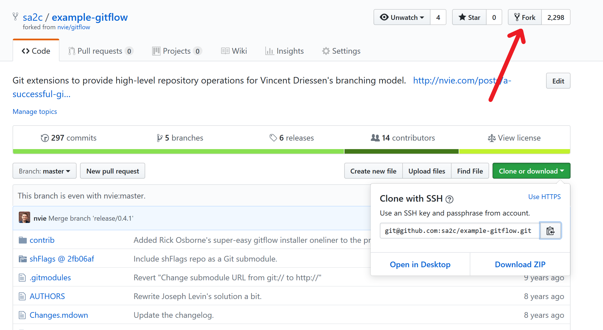



## Multiple remotes
For this section we'll need some code. We'll use a popular collection of git utility scripts called "gitflow". We've got a copy prepared for the lesson at https://github.com/sa2c/gitflow. The first thing we want to do is create a copy of this repository for us to work on. This create a fork by clicking the fork button on the top left of the page

You'll be redirected after a short wait to your own personal
repository which is a copy of one at `sa2c/gitflow`. We not need to
clone the code from your fork.
First we change directory to the desktop, with
~~~
$ cd ~/Desktop
~~~
{: .language-bash}
Next, we find the URL of the forked repository under "Clone or download" on its github.com page. We clone clone using our own personal fork, which should look something like this:
~~~
$ git clone git@github.com:<username>/example-gitflow.git
~~~
{: .language-bash}
Where `<username>` is your github username.
~~~
$ cd example-gitflow
~~~
{: .language-bash}
Let's check the remotes we have with the command
~~~
$ git remote -v
~~~
{: .language-bash}
We see a single remote, named `origin`. This is set up for us by `git
clone` when we create a new repository. It points to the place we
downloaded the code for, in this case this is our fork of the code.

Often, we may want to be able to pull changes directly from the repository we forked. For example if some other developers have made added some commits there.

In order to push to multiple repositories, we need to add them as additional remotes
~~~
$ git remote add upstream git@github.com:sa2c/example-gitflow
~~~
{: .language-bash}
We now see two repositories, `origin` and `upstream`. We can add the
`-vv` and `-a` flags to the `git branch` command to see all branches
~~~
$ git branch -vv -a
~~~
{: .language-bash}
we can now pull from upstream with
~~~
$ git pull upstream master
~~~
{: .language-bash}
This will pull from `upstream/master` into the current branch
(`master`), we can then push any changes we've pulled down to own
repository (`origin`), using.
~~~
$ git push origin master 
~~~
{: .language-bash}
This was not very exciting, because there are no new changes in the
master branch of upstream. But there is in fact a `hello-gitters`
branch which contains a small change based off `master`, which we can
pull instead. Let's first fetch all the latest changes
~~~
$ git fetch -a
~~~
{: .language-bash}
And take a look at `upstream/hello-gitters`
~~~
$ git log --oneline upstream/hello-gitters -5
~~~
{: .language-bash}
This is based off `master`, so we should have no difficulty pulling it into `master`. Let's check what it contains
~~~
$ git diff upstream/hello-gitters master
~~~
{: .language-bash}
Now that we're happy we want to merge it, we can pull with
~~~
$ git pull upstream hello-gitters
~~~
{: .language-bash}
We could also choose to use `git merge upstream/hello-gitters`. We now
push these changes to our repository with
~~~
$ git push
~~~
{: .language-bash}

We can configure as many remotes as we like. If you work closely with friends or colleagues, it could be common for you to want to pull interesting changes from their remotes, incorporate those into your current branches, and push those changes to your remote.

## Checking out remote branches
What about branches other than `master`? Can we check those out and
start work on them. Let's try it
~~~
$ git branch -vv -a
~~~
{: .language-bash}
There's a branch called `develop`. We can check this out in a local branch, with
~~~
$ git checkout --track upstream/develop
~~~
{: .language-bash}
Let's have a look at the result
~~~
$ git branch -vv -a
~~~
{: .language-bash}
We can see that we are now on a local branch `develop`, which is
configured to track the `develop` branch in `upstream`. Running `git
push` and `git pull` in this branch will automatically push to the
upstream branch. We can verify this with
~~~
$ git pull -v
~~~
{: .language-bash}
## Creating new branches
We can also create new branches locally and push those to a specific remote. In this case, let's create a new branch 
~~~
$ git checkout -b test-branch
~~~
{: .language-bash}
and check it was created
~~~
$ git branch -vv
~~~
{: .language-bash}
We notice it doesn't push anywhere by default. What happens when we type `git push`?
~~~
$ git push
~~~
{: .language-bash}
Git helpfully tells us there is no branch configured for push, and suggests how to set one
~~~
$ git push --set-upstream origin test-branch
~~~
{: .language-bash}
Let's look at our branches, we see a local `test-branch` and a
`remotes/origin/test-branch` which has been created locally. We
probably want to make some changes to `test-branch`; let's add the
`git-party` script again.
~~~
$ touch git-party
$ git add git-party
$ git commit -m 'Added git party'
~~~
{: .language-bash}
And we can push these changes, this time git knows that these changes
should go directly to `origin/test-branch`, so we can simply type
~~~
$ git push
~~~
{: .language-bash}
Let's say we're finished working with `test-branch` locally, we could
then delete the local branch
~~~
$ git checkout master
$ git branch -d test-branch
~~~
{: .language-bash}
and check the branches
~~~
$ git branch -vv -a
~~~
{: .language-bash}
We can see that the remote branch is still there, but the local branch is gone.

## Checking out unique branches: the easy way
If a branch name is unique between all remotes, and a local branch of the same name does not exist, there is a shorthand way to check the branch out.
Let's look at our branches again.
~~~
$ git branch -vv -a
~~~
{: .language-bash}
There is a remote branch `origin/test-branch`, but no local branch `test-branch`. Let's run
~~~
$ git checkout test-branch
~~~
{: .language-bash}
Git can guess that in fact we probably wanted to checkout a local copy of the remote branch origin/test-branch, since no local branch of that name exists. We can check what has happened with
~~~
$ git branch -vv -a
~~~
{: .language-bash}
and we can see that the work we push has now been fetched back from the remote with
~~~
$ git log
~~~
{: .language-bash}

>## Working together
> Find one or more partners to work with, and add the repository of
> one of the group as a new remote called "`partner`". Add a single
> commit to the develop branch. Can your partner pull the branch and
> tell you what file has changed and how?
>> ## Solution
>> The person making the change, should swap to the develop branch
>> ~~~
>> $ git checkout develop
>> ~~~
>> {: .language-bash}
>> and change any file on that branch. They should then add the file
> to the repository with
>> ~~~
>> $ git add <filename>
>> ~~~
>> {: .language-bash}
>> They should commit and push with
>> ~~~
>> $ git commit -m 'Exercise commit'
>> $ git push origin develop
>> ~~~
>> {: .language-bash}
>>The change is now on remote repository origin.
>>
>>Now it's the turn of the person trying to find the change to go and
>download it. They should also change to their develop branch with
>> ~~~
>> $ git checkout develop
>> ~~~
>> {: .language-bash}
>> They should add the remote of their partner with
>> ~~~
>> $ git remote add partner git@github.com:<username>/example-gitflow.git
>> ~~~
>> {: .language-bash}
>> where `<username>` is the github username of their partner. This
>> URL can also be obtained from the github page of the repository of
>> their partner. If this is set up correctly, they should be able to
>> pull from the partner branch with
>> ~~~
>> $ git pull partner develop
>> ~~~
>> {: .language-bash}
>> And see the changes with
>> ~~~
>> $ git diff HEAD HEAD~
>> ~~~
>> {: .language-bash}
>>or
>> ~~~
>> $ git show HEAD
>> ~~~
>> {: .language-bash}
>> if it is not a merge commit.
>>
>> This will show the file and changes that have been made.
>{: .solution}
>
{: .challenge}

> ## More about branches
> Create a new branch, call it `for-merge`, and add a single commit to it, making any changes you like as part of the commit. What do each of the following commands do
> ~~~
> $ git branch --merged master
> ~~~
> {: .language-bash}
>and
> ~~~
> $ git branch --un-merged master
> ~~~
> {: .language-bash}
>
> Can you guess what they are showing?
>
> Now merge the branch `for-merge`, using
> ~~~
> $ git checkout master
> $ git merge for-merge
> ~~~
> {: .language-bash}
> What do the `--merged` and `--un-merged` options show now? Can you
> guess what they do?
>
>> ## Solution
>> The `--merged` and `--unmerged` options filter the branches to show
>> us only ones which have been merged and only ones which have not been
>> merged respectively. This is useful when we need to determine if
>> there is any work in progress which needs to be merged.
>{: .solution}
>
{: .challenge}

>## Name it your way
> Sometimes, it's convenient or useful to give a local branch a
> different name to the remote branch. Maybe there are multiple
> remotes, and you want multiple corresponding local branches. We can
> do this with the syntax
> ~~~
> $ git checkout -b <local-branch-name> <name-of-remote>/<remote-branch-name>
> ~~~
> {: .language-bash}
>Use this command to create two local branches called `hello-gitters-origin` and `hello-gitters-upstream` which track the branch `hello-gitters` in origin and upstream respectively.
>Verify that if you make changes on `hello-gitters-origin` and push them with `git push`, you can't download them with `git pull` on the `hello-gitters-upstream` branch.
>
>>## Solution
>>Create two branches with
>> ~~~
>> $ git checkout -b hello-gitters-origin origin/hello-gitters
>> ~~~
>> {: .language-bash}
>>and
>> ~~~
>> $ git checkout -b hello-gitters-upstream upstream/hello-gitters
>> ~~~
>> {: .language-bash}
>>If you're not already there, switch to the `hello-gitters-origin` branch with
>> ~~~
>> $ git checkout hello-gitters-origin
>> ~~~
>> {: .language-bash}
>> Make some changes, for example to README.mdown and add the, for example with
>> ~~~
>> $ git add readme.mdown
>> $ git commit -m 'changes to readme.mdown'
>> ~~~
>> {: .language-bash}
>> And push the changes with
>> ~~~
>> git push
>> ~~~
>> {: .language-bash}
>> No need to specify the remote branch here, because the `git
>> checkout -b` command has set the default for us. Switch to the other
>> branch, and verify that you get no changes with
>> ~~~
>> $ git pull
>> ~~~
>> {: .language-bash}
>> You can verify that the two remote branches are in fact different with
>> ~~~
>> $ git diff origin/hello-gitters upstream/hello-gitters
>> ~~~
>> {: .language-bash}
>> which will show differences between the two branches.
>{: .solution}
>
{: .challenge}

> ## Dangers of pushing changed commits
> Note, many operations in git will modify the commit ID. This creates
> a completely independent and parallel history of commits. This is
> fine if we're the only person with access to these commits, but we
> should never do anything to commits that we've shared with the world
> which changes commit IDs. Others working on your code may end up
> with versions of history that don't match yours.
>
> Fortunately, git will warn us if we try to rewrite history that
> already exists on a remote server with `git push`.
{: .callout}

>## Shorthand for upstream remotes
>Note, if you have a remote tracking branch set, you can always refer to the remote tracking branch of the current branch with `@{upstream}` or `@{u}`
{: .callout}

## Submodules
Sometimes, we come across a piece of code that has bundled another related repository of code with it. We can check if this is the case by running
~~~
$ git submodule status
~~~
{: .language-bash}
We see the `shFlags` directory is in fact a submodule. We often notice submodules when we see directories that should have contents, but show up as empty directories. If the code author has been considerate, we'll often see submodules mentioned in the code README files, so that we know to expect them. Let's look inside `shFlags`
~~~
$ ls shFlags
~~~
{: .language-bash}
We see that it is in fact empty. To populate the `shFlags` directory with the git submodule code, we need to run
~~~
$ git submodule init
~~~
{: .language-bash}
and then
~~~
$ git submodule update
~~~
{: .language-bash}
If we look inside

Alternatively, we do everything at the same time when we first download the code. We do this with
~~~
$ git clone --recursive git@github.com:sa2c/example-gitflow.git ~/example-gitflow-submodules
~~~
{: .language-bash}
now if we have a look at the contents of `shFlags` in this respository
~~~
$ ls ~/example-gitflow-submodules/shFlags
~~~
{: .language-bash}
We can see that the submodule repository has been initialised and downloaded during the clone. This is convenient if we can remember to do so.

## Tags
Often, we want to give a useful name, such as a version number to a commit. This is something we'll often come across in other people's code. Let's look at the history to see if we can spot some
~~~
$ git log --oneline master
~~~
{: .language-bash}
We can see a few tags here, for example `0.4.1` and `0.4`. We can see all the tags in a project by running
~~~
$ git tag
~~~
{: .language-bash}
We can show a specific tag with
~~~
$ git tag -l "0.2"
~~~
{: .language-bash}
Or use a wildcard to match parts of a tag with
~~~
$ git tag -l "0.2.*"
~~~
{: .language-bash}

### Creating tags
We can create out own tag to the current commit with
~~~
$ git tag -a "my-shiny-tag" -m "this is a shiny new annotated tag"
~~~
{: .language-bash}
Let's see it in the log
~~~
$ git log --oneline -5 master
~~~
{: .language-bash}
We can now refer to the commit which has been tagged with our easy-to-remember, human-friendly name. For example, we can show the commit with
~~~
$ git show my-shiny-tag
~~~
{: .language-bash}
or show commits before the tag with
~~
~~~
$ git log --oneline -5 0.2.1
~~~
{: .language-bash}

> ## Lightweight tags
> Note that there are lightweight tags which we can use instead of
> annotated tags, by leaving out the `-a` option and the message. For
> example
> ~~~
> $ git tag my-slightly-less-shiny-tag
> ~~~
> {: .language-bash}
> But since these don't allow a commit message, and have less
> information in them, it is best to get in the habit of using the
> annotated tags for anything other than quick throw-away tagging.
{: .callout}

You can also tag commits once you've moved past them, for example
~~~
$ git tag -a a-previous-commit HEAD~5
~~~
{: .language-bash}
And we can have a look at the history of the tag
~~~
$ git log --oneline -10
~~~
{: .language-bash}
Or check it out with
~~~
$ git checkout a-previous-commit
~~~
{: .language-bash}
We can take a look where we are with
~~~
$ git log --oneline master
~~~
{: .language-bash}
Once we're done looking around, we can move back to `master` with
~~~
$ git checkout master
~~~
{: .language-bash}

### Pushing tags
Let's see what happens to the tags when we push
~~~
$ git push
~~~
{: .language-bash}
If at the repo on github.com, we'll notice that the tags are not there!
We need to push tags to remotes explicitly. By default, tags only stay on the local machine.
~~~
$ git push origin my-shiny-tag
~~~
{: .language-bash}
This shows some output like this
~~~
Counting objects: 1, done.
Writing objects: 100% (1/1), 178 bytes | 178.00 KiB/s, done.
Total 1 (delta 0), reused 0 (delta 0)
To github.com:sa2c/example-gitflow.git
 * [new tag]         my-shiny-tag -> my-shiny-tag
~~~
{: .output}
telling us that the tags have been pushed to the remote. If we looked on github.com now, we would see that the tags are now there and point to the correct commits.

> ## Share your tags
> Get into pairs with your partner from the previous exercise (you
> should still have your partner remote repository set up). One of you
> should a historic commit in their master branch. Tag the commit it
> as `exercise-commit` and push the commit to your remote origin. The
> other should fetch all tags with `git fetch partner` and find the
> commit associated with the tag. Confirm with your partner that you
> have found the right commit by telling them the first four
> characters of the commit ID and commit message.
>
> Now try the same thing with the roles reversed.
>
>> ## Solution
>> The person choosing the commit should run
>> ~~~
>> $ git tag -a exercise-commit <commit-reference-of-their-choice>
>> ~~~
>> {: .language-bash}
>> and the
>> ~~~
>> $ git push origin exercise-commit
>> ~~~
>> {: .language-bash}
>> The person guessing the commit should the run
>> ~~~
>> $ git fetch partner
>> ~~~
>> {: .language-bash}
>> and
>> ~~~
>> $ git show exercise-commit
>> ~~~
>> {: .language-bash}
>> to get the commit ID of the tag
>{: .solution}
>
{: .challenge}
